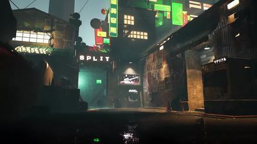

<div id="top"></div>

<br />
<div align="center">
  <a href="https://github.com/luvyana/Piana">
    
  </a>


  <p align="center">
    <br />
  </p>
</div>

# **Uiana**
Unreal Engine plugin for creating VALORANT content. Heavily inspired in Piana by Luviana.


## 📒 Requirements

Before you download the addon, you must download these first.

* [Download & Install .NET 6.0](https://dotnet.microsoft.com/en-us/download/dotnet/thank-you/runtime-6.0.5-windows-x64-installer)
* [Unreal 5.0+](https://www.unrealengine.com/en-US/download) 
* At least **30+ gb of empty space.** (SSD will be faster.)


## 🔧 Installation & Usage
1. Press Code > Download Zip > Extract it with WinRAR , 7-zip
2. Create a Plugins folder on your project if you don't already have
3. Drag "UIANA" and "UnrealPSKPSA" (made by the great Half) from the .Rar file and put it on the Plugins folder
4. Enable Python in plugins
6. Restart the engine
7. Press Uiana button (Valorant Icon) on top of the UI to open the tool
8. Inside Uiana's UI, go to Settings and fill the inputs as follows.
   ```js
   Export Folder    = "Path to save your settings & export the maps"
                    // Pick an empty folder with a lot of space.
   PAKs Folder      = "Path to VALORANT's PAK files."
                    // ..Riot Games\VALORANT\live\ShooterGame\Content\Paks\
   ```
9. Select your preferable settings and hit "Generate Map" on bottom right.
10. Voi-La
   


## Contact 
* Discord : bK#6198


## Credits
- Luviana
- floxay
- CoRe | Janik.M
- Rata
- Drice
- Devo
- Zertox

<p align="right">(<a href="#top">back to top</a>)</p>


