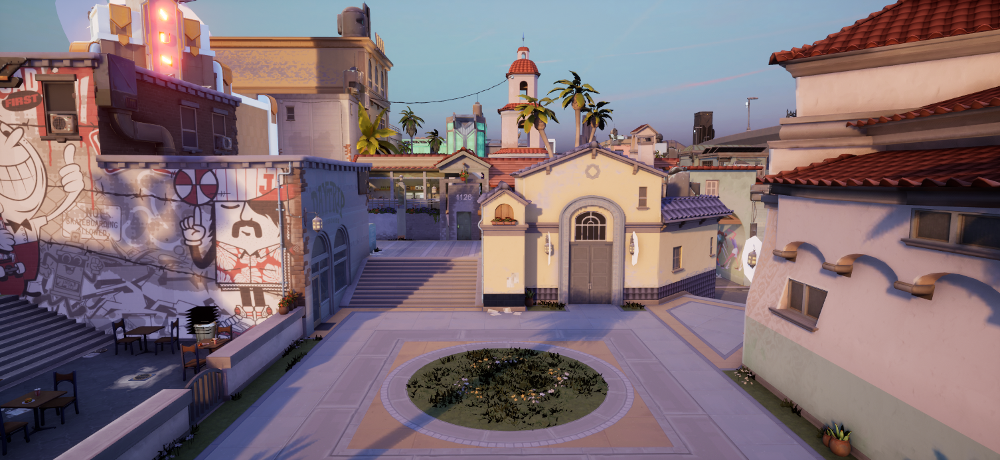

<div id="top"></div>

<br />
<div align="center">
  <a href="https://github.com/djhaled/Uiana-MapImporter">
    
  </a>


  <p align="center">
    <br />
  </p>
</div>

# **Uiana**
Unreal Engine plugin for creating VALORANT content. Heavily inspired in Piana by Luviana.


## 📒 Requirements

Before you download the addon, you must download these first.

* [Download & Install .NET 6.0](https://dotnet.microsoft.com/en-us/download/dotnet/thank-you/runtime-6.0.5-windows-x64-installer)
* [Unreal 5.0+](https://www.unrealengine.com/en-US/download) 


## 🔧 Installation & Usage
1. **[Download latest](https://github.com/djhaled/Uiana-MapImporter/releases/download/publish/Uiana-1.02.zip)**
2. Create a Plugins folder on your project if you don't already have
3. Drag "UIANA" and "UnrealPSKPSA" from the .zip file and put it on the Plugins folder
4. Press Uiana button (Valorant Icon) on top of the UI to open the tool
5. Inside Uiana's UI, go to Settings and fill the inputs as follows.
   ```js
   Export Folder    = "Path to save your settings & export the maps"
                    // Pick an empty folder with a lot of space.
   PAKs Folder      = "Path to VALORANT's PAK files."
                    // ..Riot Games\VALORANT\live\ShooterGame\Content\Paks\
   ```
6. Select your preferable settings and hit "Generate Map" on bottom right.
   


## Contact 
* Discord
  - bK#6198
  - Zain#1873


## Credits
- Whole Piana team (Luviana,floxay,CoRe | Janik.M,Rata,Drice,Devo,Zertox)
- Zain (Scripting and Shader)
- TheyCallMeSpy (Shader and ideas)
- Patchzy (Shader and ideas)
- BK
- Halfuwu (PSKX importer)


<p align="right">(<a href="#top">back to top</a>)</p>


