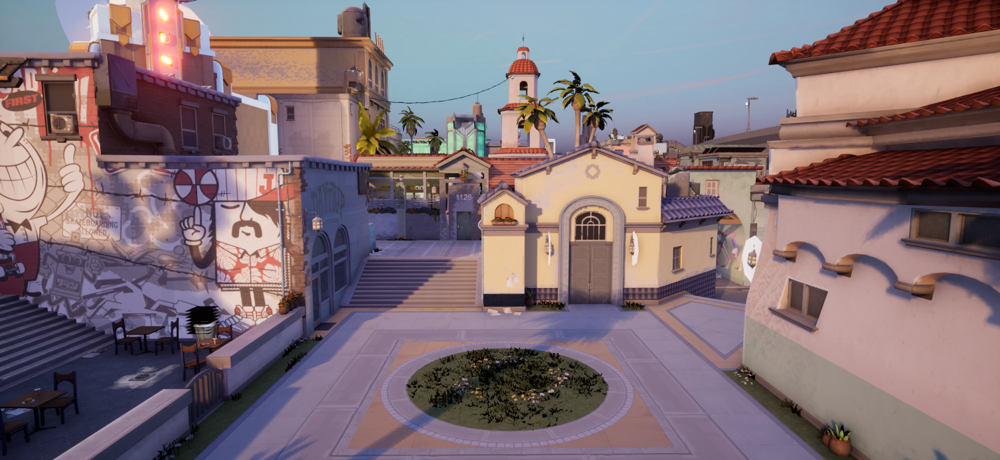

<div id="top"></div>

<br />
<div align="center">
  <a href="https://github.com/djhaled/Uiana-MapImporter">
    
  </a>
  <p align="center">
    
    
    
  </p>
</div>

#  Uiana - VALORANT Map Importer

**Uiana** is an Unreal Engine 5 editor plugin for importing VALORANT game maps. It extracts map data from VALORANT's PAK files and imports them into Unreal Engine with materials, meshes, lighting, and decals. Heavily inspired by [Piana](https://github.com/Lava-Powered/Piana) by Luviana.

## Features

- Import VALORANT maps directly into Unreal Engine 5
- Automatic extraction of meshes, materials, textures, and decals
- Support for sublevels and lighting import
- Built-in CUE4Parse integration for asset extraction
- UEFormat support for mesh assets (`.uemodel`)

## Requirements

Before installing the plugin, ensure you have the following:

- [Unreal Engine 5.0+](https://www.unrealengine.com/en-US/download)
- [.NET 6.0 Runtime](https://dotnet.microsoft.com/en-us/download/dotnet/thank-you/runtime-6.0.5-windows-x64-installer)
- [Visual Studio 2019+](https://docs.unrealengine.com/4.26/en-US/ProductionPipelines/DevelopmentSetup/VisualStudioSetup/) (with C++ support)
- VALORANT game files (PAK files)
- Mesh assets exported in **UEFormat** (`.uemodel`) using [FModel](https://github.com/4sval/FModel) or [CUE4Parse](https://github.com/FabianFG/CUE4Parse)

## Installation

### 1. Download the Plugin

1. **[Download the latest release](https://github.com/djhaled/Uiana-MapImporter/releases)**
2. Extract the ZIP file

### 2. Install Dependencies

Install the [UEFormat](https://github.com/h4lfheart/UEFormat) plugin:

1. Clone the UEFormat repository and switch to the **unreal** branch
2. Copy the inner `UEFormat` folder (containing `UEFormat.uplugin`) to your **project's** `Plugins` folder
3. Alternatively, clone this repo with submodules: `git clone --recurse-submodules` and copy `UEFormat/UEFormat` to your project's Plugins folder

### 3. Install Uiana Plugin

1. Create a `Plugins` folder in your Unreal Engine project root (if it doesn't exist)
2. Copy the `Uiana` folder from the downloaded ZIP into your project's `Plugins` folder
3. **Important:** Install in your **project's** Plugins folder, NOT the Engine Plugins folder
4. Rebuild your project in Visual Studio if prompted

### 4. Verify Installation

1. Open your Unreal Engine project
2. Look for the Uiana icon in the toolbar at the top of the editor
3. Click the icon to open the Uiana import window

## Usage

### Initial Setup

1. Open Uiana from the toolbar icon
2. Go to **Settings** in the Uiana UI
3. Configure the following paths:

   | Setting | Description | Example Path |
   |---------|-------------|--------------|
   | **Export Folder** | Path to save exported maps and settings | `D:\UianaExports\` |
   | **PAKs Folder** | Path to VALORANT's PAK files | `C:\Riot Games\VALORANT\live\ShooterGame\Content\Paks\` |

### Importing a Map

1. Select your desired import settings (meshes, materials, lights, decals, etc.)
2. Choose the map you want to import
3. Click **"Generate Map"** in the bottom right
4. Wait for the extraction and import process to complete

### Post-Import Steps

1. **Save your work:** Save the `ValorantContent` folder and the level after importing
2. **Build lighting:**
   - Open the **Build** tab (top left)
   - Set lighting quality (Preview for fastest bake times)
   - Click **"Build Lighting Only"**
   - Click **"Build Reflection Captures"**
   - Ensure Global Illumination is set to **"None"** in the Post-Process Volume

## Configuration Options

| Option | Description |
|--------|-------------|
| Import Decals | Import decal textures and placements |
| Import Blueprints | Import actor blueprints |
| Import Lights | Import lighting information |
| Import Meshes | Import static meshes |
| Import Materials | Import material definitions |
| Import Sublevels | Import sublevel data |
| Lightmap Resolution | Multiplier for lightmap resolution |

## Common Issues & Solutions

| Issue | Solution |
|-------|----------|
| "Modules are missing or built with different engine" | Rebuild your Unreal project in Visual Studio |
| Can't import more than 1 map | Rename the current `ValorantContent` folder, then import a new map |
| Crash while building lights | Save the map before building lighting |
| White VFX meshes | Delete them as a temporary fix (known issue being worked on) |

## Development

### Project Structure

```
Uiana/
├── Source/Uiana/           # C++ plugin source code
├── Content/Importer/       # Import tools and assets
│   ├── tools/cue4extractor/ # C# asset extraction tool
│   └── assets/             # JSON configuration files
└── Resources/              # Plugin icons and resources
```

### Building from Source

1. Clone the repository: `git clone https://github.com/djhaled/Uiana-MapImporter.git`
2. Open your Unreal project with the plugin installed
3. Build the project in Visual Studio

## Credits

- **Piana Team:** Luviana, floxay, CoRe, Janik.M, Rata, Drice, Devo, Zertox
- **Zain:** Scripting and Shader development
- **TheyCallMeSpy:** Shader and ideas
- **Patchzy:** Shader and ideas
- **BK:** Plugin development
- **[UEFormat](https://github.com/h4lfheart/UEFormat):** .uemodel/.ueanim importer

## Support

- **Discord:** [Join our server](https://discord.gg/ARFEYZZwMV)
  - bkhimothy
  - ka1serm
- **PayPal:** [Support the project](https://www.paypal.com/cgi-bin/webscr?cmd=_donations&business=bekmassruha1407@gmail.com&lc=US&no_note=0&item_name=Thank+you+for+suppporting+Uiana+Map+Import+Plugin+development+&cn=&curency_code=USD&bn=PP-DonationsBF:btn_donateCC_LG.gif:NonHosted)

## Disclaimer

**Uiana-MapImporter was created under Riot Games' "Legal Jibber Jabber" policy using assets owned by Riot Games. Riot Games does not endorse or sponsor this project.**

## License

This project is provided as-is for educational and content creation purposes. Please respect Riot Games' terms of service when using extracted assets.

<p align="right">(<a href="#top">back to top</a>)</p>
